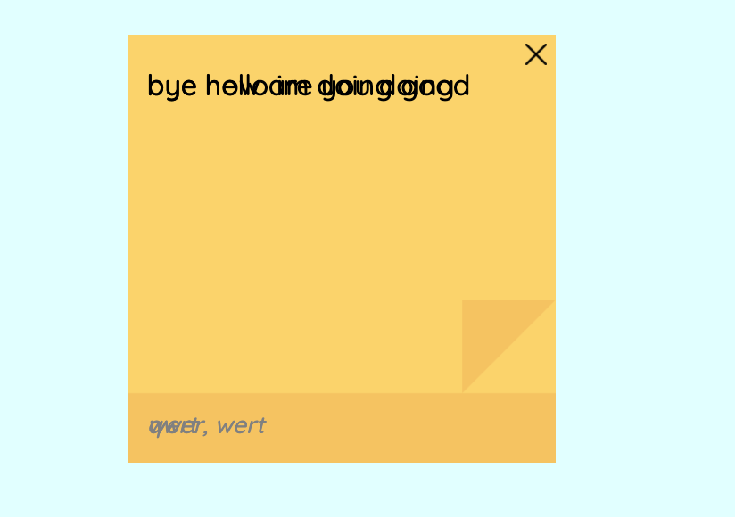
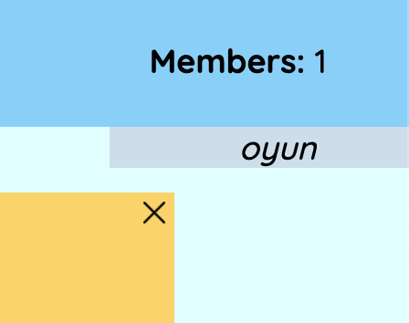
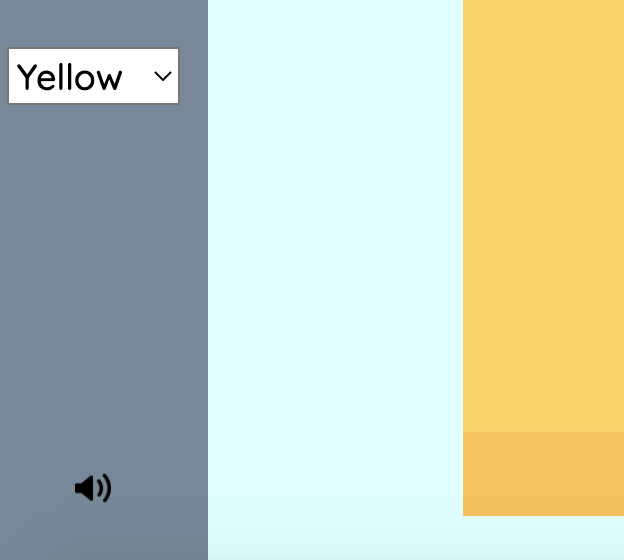

# Project Three

Project 3 - Create a web application that has both client-side and server side code. Similar to Project #2, users who engage with your application site must have some ability to “connect” with other users. This could be done by collecting user data, storing it in a database, and sharing it back with other users. Or this could be done by incorporating real-time connections and communication via Sockets or WebRTC. 

See project [here](http://stick-it-2.glitch.me/).

## Project Plan
### Design and Planning

For the final project, without a hesitation, I decided to continue working on my Project 2. As a reminder, my project 2 was a sticky-note application with real-time interactions where users can enter rooms and add/edit/collaborate on sticky notes with the other users in the room. I used Express and Node.js for the back-end, socket.io for real-time interactions and strictly HTML/CSS for the front-end. 

One feedback that I kept getting while presenting my project 2 to my classmates and doing user testing with my roommate and a few of my friends was that for the website to be fully utilizable on a day-to-day basis, it needs to be able to save data such that the user can access previous information even after closing the browser or logging out. And it completely made sense. As someone who uses paper sticky notes regularly, I certainly would want to save my notes and be able to look back on it when the need arises. Only perhaps then, I would actually consider going digital and use my website in place of physical notes. Thus, 

implementing databases was the utmost priority and one of the biggest additions I planned to make on my previous project. Furthermore, as I saw my project being not only used for personal matters, but also used as a collaborative note-taking application that teams can use to brainstorm and visually organize texts, I planned to explore more the connective side of the application and add a video chat feature so that users collaborating on notes can easily communicate with each other on the website without having to switch platforms. Other than the two big additions, I wanted to add small but important edits/changes to improve user experience, such as improving sizing of fonts and images for better visual experience. 


### Process

Remembering the feedback that professor gave me about how making a Note class and making each note an object would make my code cleanar and more organized, I started off by going through my code and implementing the feedback. Initially, making a Note class seemed quite manageable. I was able to separate the functions relating to the notes and create a rough note class. 

```
class Note{
    constructor(id, color){
        this.id = id;
        this.color = color;
        this.text = '';
        this.type = '';
        this.contributors = [];
    }
    
    addContributor(contributor){...}
    
    addNote(){...}
    
    addText(noteText, noteType, noteContributor){...}
    
    removeNote(){...}
}
```

With the creation of the new Note class, my code became a lot more structured and organized. The initial code worked and I was able to add the note images on the website. However, adding text got a bit tricky. As the note functions are specific to the note instance, any changes made had to be applied to the specific note. This meant there needed to be an array to store all note objects and depending on which note was edited/removed, the note object had to be taken from the array and applied the desired function. 

```
    <!--   code excerpt for removing a note   -->
    <!--   notes is an array containing all note objects   -->
    
    let note = notes.filter((e) => e.id == id_num);
    note[0].removeNote();
    notes = notes.filter((e) => {return e.id != id_num});
```

I used the filter function to get the specific note object that was called from the array and after then, made changes to its variables. This method worked pretty well. 

After 'finishing' up my Note class, I began working on implementing neDB. Other than the small twitter-like application we made in class, I didn't have much experience working with databases, so I reviewed the concepts and referred back to our previous classes. After working on it for a while, I added the code for neDB and finally ran it, but got a lot of errors whenever I logged into a second client to see the fetched note data. Some empty notes were showing but notes with any text within it, was not showing at all. Sometimes, note texts would overlap with each other, which is an error that I never got before. 





Largely due to the complex code that I had for adding texts, after two days of tries, I could not solve the issue and tried going back to my version of the code without the Note class to see if I could 

It was a bit tricky to manage the array of note objects and update them whenever a change was made by the client, displaying such notes through databases and allowing the client to make edits on fetched data and syncing it across all clients, so I decided to go back to my version of the code without the Note class to see if I could implement it without issues. 

After going back to the old version and implementing the databases, the overlapping issue was gone and both notes and texts were added without much big problems. Therefore, I decided to stick with the old approach. Perhaps, in the future, I will fully rewrite and organize my code from the very beginning, but for the time being, I decided to use my previous code.

After spending so much time on debugging issues related to neDB and finally kind of making it work, I turned to WebRTC for the video chat features. However, since I had zero experience using WebRTC, I could not figure out how to combine the server codes together and establish peer connections for video and combined with the fact that I spent too much time on neDB, I did not have much time left to explore the almost new concept and add it on to my already complicated code. With this in mind and after talking to my professor, I decided not to pursue WebRTC and instead work on adding shared sound effects on add text/note actions through the front-end so that it adds the connective element to it. 

Another edit I wanted to make since my last project was showing the users in the room. For some reason, I thought I would need a database to get all the usernames of clients in the room, but it turned out to be quite simple. Whenever the mouse hovers over the 'Members' text, a block will appear containing all the current users in the room. 



During user testing my project 2 on the big screen, I saw that my website looked very oddly sized. Although on my system, the sizing was appropriate, on systems with larger screens, the fonts, buttons and images looked a bit too small. This was a big pull down in terms of user experience, so I intentionally worked on the large Mac desktops in the library to figure out the appropriate dimensions. For images and also some fonts, I tried to use vh/vw instead of pixels and em/rem. But I realized I had to extra cautious when using vh/vw because even though using them to resize the elements made sure that the sizes of elements would be relative to the screen, it sometimes made some elements too big on smaller screens, so I had to constantly switch between screens to see which worked, which didn't and what to change. Now it looks a lot more natural even on larger screen, so users would not have to struggle to read the extremely small texts and buttons. 

While doing user testing with my friend, she recommended that it would be helpful to have mute sound options. Especially now with the added sound effects to add note/text actions on top of the previously existing remove sound, some people may not want to repeatedly hear the sound, so it can be helpful to have mute option. I added a button at the bottom of the side bar that once pressed, will mute all sound effects, and pressed again, will enable sound. 



Altogether, these were all the changes that I made: implementing databases, adding sound to add the connected element to it, making sizing more appropriate and adding sound options for better user experience. I was quite content with the design of the website, so mostly kept it the same way as Project 2. I didn't want to make changes just for the sake of making changes, so I tried to only make edits that made sense and tangibly improved user experience. 


### Challenges and Future Improvements

Implementing databases and making it work turned out to be so much harder and time-consuming than I expected and I spent most of my time trying to understand why certain things weren't working, or were working with faults. As much as I attempted to clean up my code, it just kept leading to unseen errors that I couldn't fix, so for this project, I mostly kept my previous code and added more code to it. This is perhaps the only project that I am really proud of making and actually genuinely enjoyed making, so I plan to work on it in the summer to polish the code, fix small issues, and perhaps add WebRTC video chat features like my original plan to turn this into a project that I can talk about proudly in the future. 

### Credits
[Sticky note image](https://www.flaticon.com/free-icon/sticky-notes_3209265?term=sticky%20note&page=1&position=4&page=1&position=4&related_id=3209265&origin=search) taken from flaticon

[Sticky note icon](https://www.flaticon.com/free-icon/sticky-notes_3209265?term=sticky%20note&page=1&position=4&page=1&position=4&related_id=3209265&origin=search) taken from flaticon

[Sound effect](https://www.zapsplat.com/) taken from Zapsplat
 
